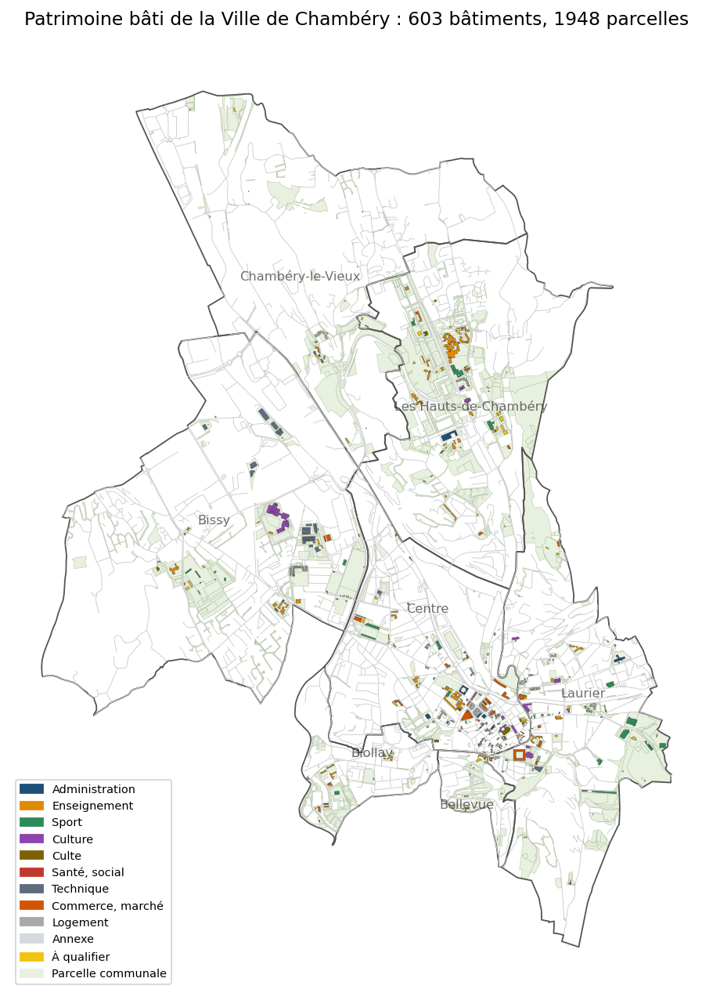
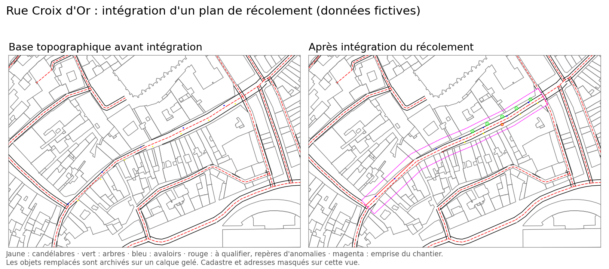
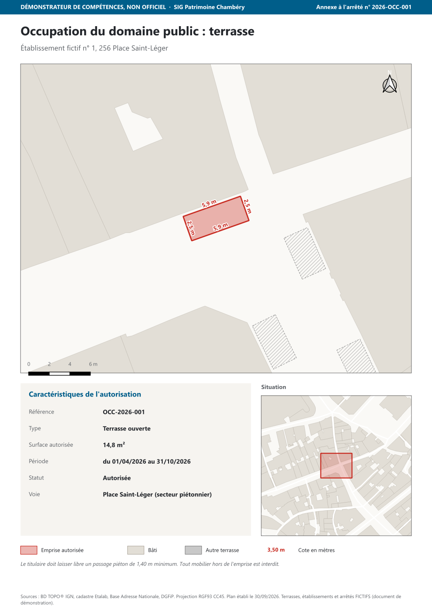
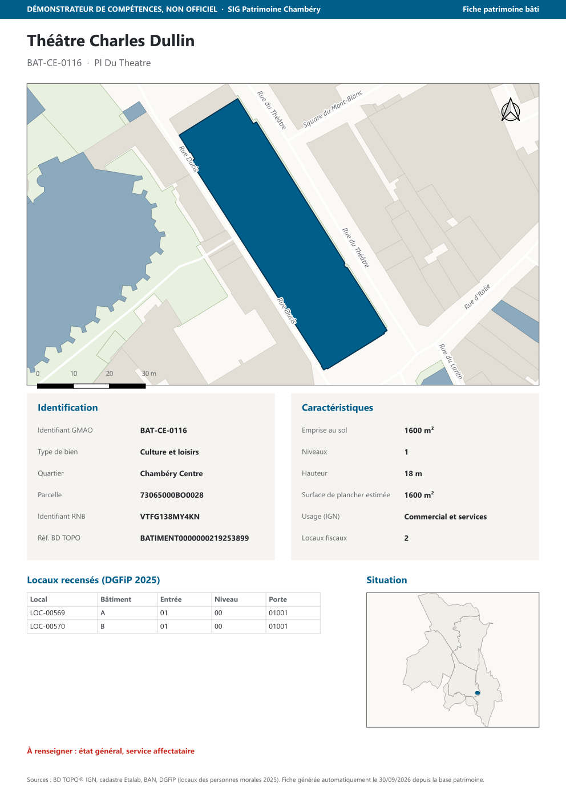

# SIG Patrimoine Chambéry : démonstrateur de compétences

**Tableau de bord en ligne : https://jauresmas.github.io/sig-patrimoine-chambery/**

> Démonstrateur de compétences, non officiel : ce projet n'émane pas de la Ville de Chambéry.

Projet démonstrateur d'un système d'information patrimonial municipal, construit
uniquement à partir de données ouvertes. Il reproduit les tâches d'un gestionnaire
de données graphiques : tenir à jour un référentiel de biens (bâtiments, locaux,
voies, occupations du domaine public), le relier à une GMAO et en tirer des plans
et des restitutions.

## Volet 1 : base de données patrimoniale (fait)

| Couche | Objets | Origine |
|---|---:|---|
| Bâtiments communaux | 603 | BD TOPO IGN, sélectionnés sur les parcelles de la commune |
| Parcelles communales | 1 948 | Cadastre Etalab + fichier DGFiP des personnes morales 2025 |
| Locaux communaux (table) | 1 066 | Fichier DGFiP des locaux des personnes morales 2025 |
| Référentiel des voies | 782 | BD TOPO, voies nommées alignées sur la BAN |
| Tronçons de voirie | 4 873 | BD TOPO, avec domanialité présumée |
| Équipements et lieux d'intérêt | 333 | BD TOPO |
| Terrasses et étals | 0 | Schéma prêt, saisie au volet 3 |
| Quartiers | 7 | Open data de la Ville |

Points clés du modèle :

- **Identifiant de bien unique** `BAT-<quartier>-<n°>` conçu comme clé commune avec la GMAO (AS-TECH).
- **Domaines de valeurs** (type de bien, état, service affectataire, domanialité, statut d'autorisation).
- **Classe de relations** bâtiment 1-n locaux dans la géodatabase, relation de projet dans QGIS.
- **Alias en français** sur tous les champs.
- **Système CC45 (EPSG:3945)**, celui des données publiées par la Ville.
- **Même modèle, deux formats** : géodatabase fichier pour ArcGIS Pro et GeoPackage pour QGIS,
  générés par un seul script à partir de `scripts/schema.py`.

Documentation produite :

- [Dictionnaire de données](docs/dictionnaire_donnees.md)
- [Rapport de contrôle qualité](docs/controle_qualite.md) : unicité, géométrie, intégrité
  référentielle, domaines, chevauchements, plus les listes de travail (bâtiments à nommer ou à qualifier).

## Volet 2 : intégration d'un plan de récolement (fait)

Chaîne complète sur un réaménagement **fictif** de la rue Croix d'Or :

1. `07_base_topo.py` reconstitue un extrait de la base topographique de la Ville (DXF, CC45) selon
   une [charte de calques et de blocs](scripts/charte_topo.py) : bâti, cadastre, axes, bordures,
   mobilier, textes.
2. `08_recolement_fictif.py` simule le DXF livré par un géomètre, avec les écarts courants :
   Lambert 93 au lieu de CC45, nomenclature du prestataire, objets sur le calque 0, doublon,
   attribut manquant, coordonnée erronée, habillage mélangé aux objets.
3. `09_integration_recolement.py` contrôle, met en cohérence et intègre :
   détection et transformation du système de coordonnées, correspondance calques / blocs / attributs,
   suppression des doublons, mise à l'écart des objets douteux sur un calque de contrôle,
   archivage des objets remplacés sur un calque gelé, audit DXF.

Livrables : [rapport de contrôle](docs/controle_recolement.md) avec la demande de reprise au
prestataire, `donnees/topo/base_topo_secteur_croix_d_or_maj.dxf` (lisible par AutoCAD et QGIS).

## Volet 3 : plans types (fait)

| Plan | Format | Fichier |
|---|---|---|
| Terrasse annexée à l'arrêté, une page par terrasse (atlas), emprise cotée | A4 portrait | [plan_terrasses_arretes.pdf](sorties/plan_terrasses_arretes.pdf) |
| Dispositif de sécurité d'une manifestation (périmètre, barrages, accès secours, voie engins) | A3 paysage | [plan_manifestation.pdf](sorties/plan_manifestation.pdf) |
| Voirie communale pour le conseil municipal, linéaire par quartier et domanialité | A3 portrait | [plan_voirie_conseil_municipal.pdf](sorties/plan_voirie_conseil_municipal.pdf) |

Les terrasses sont saisies dans la couche `occupation_domaine_public` de la base : l'emprise
tirée des façades BD TOPO donne la surface et les cotes, et l'arrêté reprend ses attributs.
Les établissements, arrêtés et la manifestation sont **fictifs** (mention portée sur chaque plan).
Les trois mises en page sont modifiables dans `plans_volet3.qgz`.

## Volet 4 : restitution des données (fait)

| Livrable | Contenu |
|---|---|
| [Fiches bâtiment](sorties/fiches/) | 156 fiches PDF (bâtiments nommés), générées par atlas QGIS : identification, caractéristiques, carte, locaux issus de la relation bâtiment / locaux, points à renseigner. `TOUS = True` produit les 603 fiches. |
| [Tableau de bord](sorties/tableau_de_bord.html) | Page HTML autonome : indicateurs, carte Leaflet sur Plan IGN filtrable par quartier et par type, graphiques, liste de travail, lien vers la fiche de chaque bâtiment. |
| [Jeu open data](sorties/open_data/) | GeoJSON et CSV (WGS84), libellés des codes en clair, champs internes retirés, descripteur `datapackage.json` (Frictionless Data) et LISEZMOI, Licence Ouverte 2.0. |

## Chaîne de traitement

Scripts à lancer avec le Python de QGIS (`python-qgis-ltr.bat`), dans l'ordre :

| Script | Rôle |
|---|---|
| `01_collecte.py` | Téléchargement des sources (WFS IGN, cadastre, BAN, DGFiP, open data Ville) |
| `02_base_patrimoine.py` | Construction des couches et écriture `.gdb` + `.gpkg` |
| `03_controles_dictionnaire.py` | Contrôles qualité et dictionnaire de données |
| `04_projet_qgis.py` | Projet QGIS stylé avec la relation bâtiment / locaux |
| `05_donnees_plans.py` | Terrasses et dispositif de manifestation de démonstration |
| `06_plans.py` | Mises en page QGIS et export PDF des trois plans types |
| `07_base_topo.py` | Extrait de base topographique DXF selon la charte de la Ville |
| `08_recolement_fictif.py` | Plan de récolement de démonstration (tel que livré par un prestataire) |
| `09_integration_recolement.py` | Contrôle, mise en cohérence et intégration du récolement (ezdxf) |
| `10_fiches_batiments.py` | Fiches PDF par bâtiment (atlas QGIS) |
| `11_open_data.py` | Export open data et descripteur Frictionless |
| `12_tableau_de_bord.py` | Tableau de bord HTML (modèle : `tableau_de_bord_modele.html`) |

Modules communs : `schema.py` (modèle de données), `charte_topo.py` (charte DAO), `mise_en_page.py`
(charte graphique des mises en page), `ecriture.py` (écriture .gdb / .gpkg).

## Limites assumées

- La propriété communale vient du fichier fiscal DGFiP : les biens loués ou mis à disposition
  n'y figurent pas, et les locaux sont rattachés au bâtiment principal de leur parcelle.
- L'état, le service affectataire et une partie des noms restent « non renseignés » :
  ce sont des informations internes qu'une GMAO et des visites apportent.
- La domanialité des voies est déduite de la BD TOPO et doit être confirmée par le tableau
  de classement de la voirie communale.

## Sources et licences

BD TOPO IGN (Licence ouverte Etalab 2.0), cadastre Etalab, Base Adresse Nationale,
fichiers des locaux et des parcelles des personnes morales (DGFiP), quartiers de la
Ville de Chambéry (data.gouv.fr).
