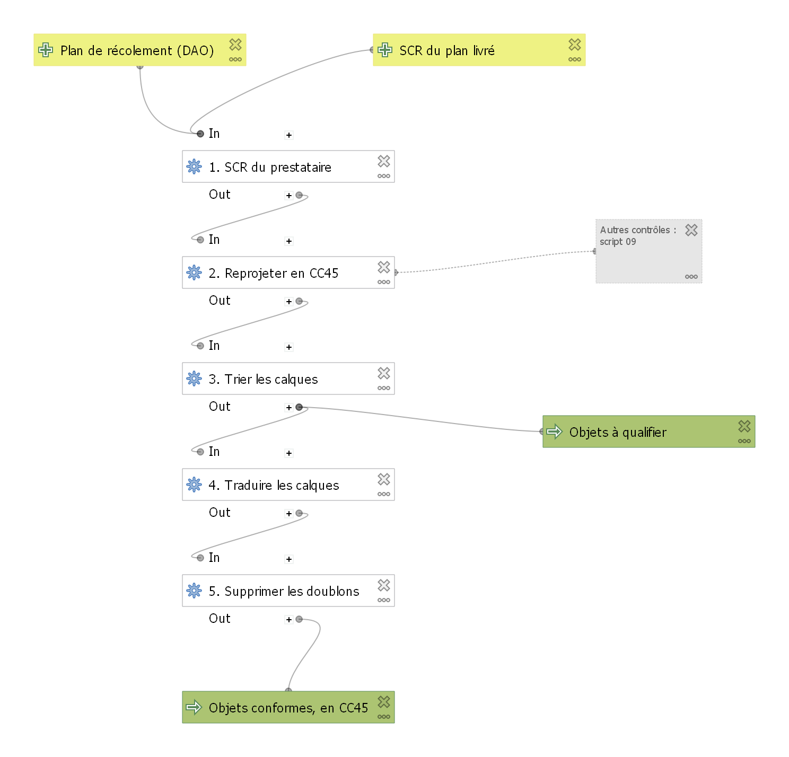

# Modèle graphique : intégration d'un plan de récolement

Modèle QGIS (`modeles/integration_recolement.model3`), équivalent d'un modèle ModelBuilder d'ArcGIS Pro. À ouvrir dans QGIS : *Traitement > Boîte à outils > Modèles > Ouvrir un modèle existant*.

| Étape | Outil QGIS | Équivalent ArcGIS Pro |
|---|---|---|
| 1. Définir le SCR du prestataire | Définir la projection | Define Projection |
| 2. Reprojeter en CC45 | Reprojeter une couche | Project |
| 3. Calques de la charte / à qualifier | Extraire par expression | Select (Split by Attributes) |
| 4. Traduire les calques | Calculatrice de champ | Calculate Field |
| 5. Supprimer les doublons | Supprimer les géométries dupliquées | Delete Identical |

## Exécution sur le DXF du géomètre (fictif)

| Géométries | Objets reçus | Conformes | À qualifier | Calques Ville obtenus | Calques à qualifier |
|---|---:|---:|---:|---|---|
| LineString | 7 | 4 | 3 | REC_EMPRISE, VOI_BORDURE | 0, MOBILIER_DIVERS |
| Point | 23 | 18 | 4 | ASS_AVALOIR, ECL_CANDELABRE, VEG_ARBRE | CARTOUCHE, COTATION |

Les coordonnées de sortie sont en CC45 (X de l'ordre de 1 928 000 m), le plan était livré en Lambert 93 (X de l'ordre de 940 000 m).
